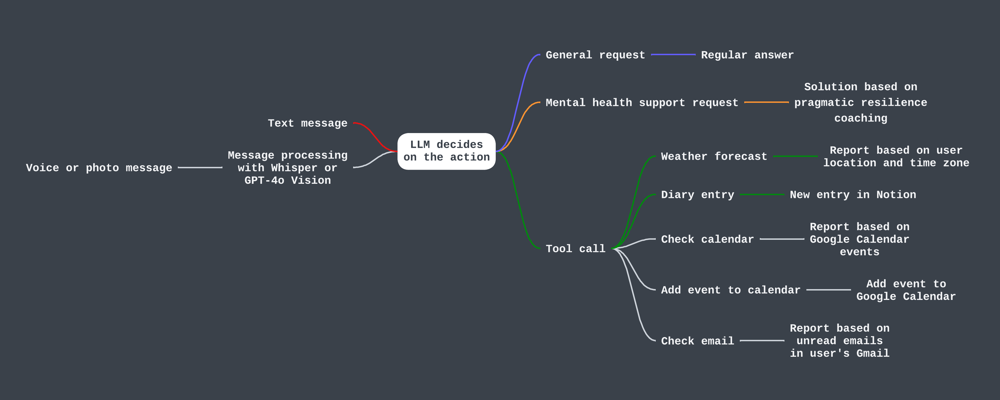

# Panza: Personal Agent for Notifications, Zest, and Assistance

**Note**: the agent is in active development.
Feel free to contact me if you want to collaborate on the project.
- Telegram: @gvzdv
- Email: mv(dot)gvozdev(at)gmail

## Features
**Implemented**:
- Weather forecasts by request
- General support
- Streamlining journaling: reminders about daily diary entries and writing content in Notion

**Planned**:
- Stateful history storage
- Managing Google calendar (adding meetings and reporting on meeting itineraries by request)
- Gmail management: reports on unread emails
- Voice message transcriptions and image processing

### Agent Schema
Implemented features are marked with coloured paths.<br>
Features in development are gray.


## Setup Instructions

This project requires setting up a server and configuring a Notion database, a Telegram bot, and an OpenAI API key. Follow the steps below to set up your environment.

---

### Prerequisites

Ensure you have a `.env` file with all the required environment variables. Use `.env.example` as a reference for the necessary keys.

---

### 1. Setting Up the Notion Database

The Notion database will store diary entries in a calendar format.

#### Steps:

1. **Create a Notion Integration**:
   - Go to [Notion Developers](https://www.notion.so/my-integrations) and create a new integration.
   - Note the **Integration Token** provided after creation.

2. **Set Up a Notion Database**:
   - In Notion, create a new page and choose the "Table" or "Calendar" view.
   - Ensure your database includes columns for the diary entry title, date, and any additional fields you need.

3. **Share the Database with the Integration**:
   - Click "Share" at the top-right corner of your database page.
   - Add the integration by pasting its email address (found in the integration settings).

4. **Get the Database ID**:
   - Open your Notion database in a browser.
   - The Database ID is the part of the URL between `/` and `?`, for example:
     ```
     https://www.notion.so/workspace_name/Database-ID?view_name
     ```
   - Copy and paste this ID into your `.env` file as `NOTION_DB_ID`.

5. **Add the Token to `.env`**:
   - Add the Integration Token to your `.env` file:
     ```
     NOTION_TOKEN=your_integration_token
     ```

---

### 2. Setting Up a Telegram Bot

The Telegram bot facilitates interaction with the application.

#### Steps:

1. **Create a Bot**:
   - Open Telegram and search for "BotFather".
   - Start a chat and type `/newbot` to create a new bot.
   - Follow the instructions to name your bot and get its **Bot Token**.

2. **Add the Bot Token to `.env`**:
   - Add the token to your `.env` file:
     ```
     BOT_TOKEN=your_bot_token
     ```

3. **Set Up the Webhook**:
   - Deploy your application to a server with HTTPS support.
   - Use the Telegram Bot API to set the webhook:
     ```
     https://api.telegram.org/bot<YOUR_BOT_TOKEN>/setWebhook?url=<YOUR_WEBHOOK_URL>
     ```
     Replace `<YOUR_BOT_TOKEN>` with your bot token and `<YOUR_WEBHOOK_URL>` with your server's webhook endpoint (see p.4).

4. **Find Your Telegram User ID**:
   - Start the bot and send any message.
   - Check the logs or use a tool like @userinfobot to retrieve your Telegram User ID.
   - Add this ID to your `.env` file:
     ```
     TELEGRAM_USER_ID=your_user_id
     ```

---

### 3. Getting OpenAI API Key

This project uses the OpenAI API to process requests.

#### Steps:

1. **Sign Up for OpenAI**:
   - Go to [OpenAI](https://platform.openai.com/) and create an account.

2. **Generate an API Key**:
   - Navigate to the API section and generate a new API key.

3. **Add the API Key to `.env`**:
   - Add the key to your `.env` file:
     ```
     OPENAI_API_KEY=your_openai_api_key
     ```

---

### 4. Setting up server

Telegram bot needs a runtime.

#### Steps:

1. **Set up a server with the provider of your choice (GCP, AWS, Azure, Fly.io, PythonAnywhere, etc.)**:
   - The project has a `Dockerfile` required for deployment.


2. **Add the URL to `.env`**:
   - Add the URL to your `.env` file:
     ```
     SERVICE_URL=web_service_url
     ```

---

### 5. Setting Up App Secret

Secure your Flask app with a secret key.

---

### 6. Setting Your Coordinates

Your location is required for an accurate weather forecast.
Set up your katitude and longitude in a decimal format (i.e. `35.49185487954087, 135.74545667158725`)

---

### 7. Setting Your Local Timezone:
Open the .env file and add a key for the local timezone. Use a valid timezone string from the [IANA Timezone Database](https://en.wikipedia.org/wiki/List_of_tz_database_time_zones).
Example:
`LOCAL_TIMEZONE=America/Montreal`

---

### 8. Verify Environment Variables

Ensure your `.env` file contains the necessary keys (refer to `.env.example` for formatting)

---


## Talk To Your Assistant

Once you've taken the setup steps, navigate to your bot in the Telegram interface, and text it.

Possible interaction scenarios:

- "Hey, how do I set up a server on Google Cloud?" -> The assistant helps you as ChatGPT.
- "What's the weather today?" -> You will receive a weather report for the next 12 hours.
- "Write this in the diary: I'm feeling tired yet grateful for finishing part of this project. Looking forward to adding extra functionality!" -> The assistant will save this entry in your Notion diary and come back with confirmation.
- "I'm feeling like I haven't achieved much today. What a waste of a day" -> The assistant will suggest a solution based on pragmatic resilience coaching and practical wisdom therapy.